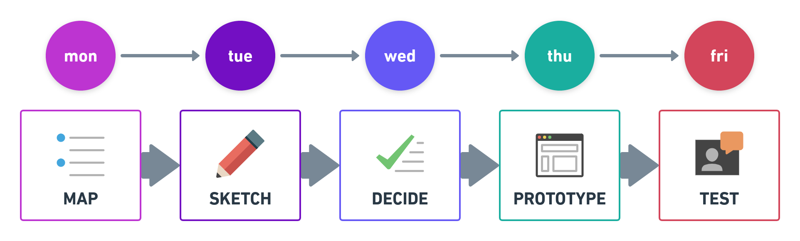

# UX Work Process

* como focar no valor e nao nos artefatos
* como gastar a maior parte do tempo otimizando o produto
* como trabalhar em equipe
* como convencer chefes, desenvolvedores e demandantes a olhar o mundo sob a ótica dos usuarios
* como gerar consenso dos objetivos com pouca documentação

* Work Process involucra
  * designers
  * CEO
  * developer
  * tester

* Two interesting Work Process:
  * **1. LEAN UX**
  * **2. Desing Sprint**
  
## 1. LEAN UX

LEAN UX is based on Design Thinking, Agile Methodology, and Lean Startup.

### Design Thinking

Design Thinking seeks to see everything through the user's eyes.

### Agile Methodology

Agile Methodology allows you create things continuosly and establish an improvement process each time a product is delivered.

### Lean Startup

Lean Startup seeks to bring ideas as soon as possible to the market to obtain feedback and work in the continuous improvement of the product 

## LEAN UX Principles

LEAN UX principles help us establish a new work culture for ourselves.

## 2. Design Sprint

**Design Sprint** is all about gathering a lot of knowledge and reaching an agreement with your team in a very short time.

[Design Sprint](https://www.thesprintbook.com/how) is to **build** and **test** a prototype in just **five days**:

### Preparation - Before the Sprint begins

* You need block out the entire week in the calendar
* You need to recruit a team with diverse skills: 
  * A decider and facilitator,
  * Experts (Marketing, Design, Technology, Financial), and
  * Customer service.
* You need to find the right room
* You need get the right materials:
  * Whiteboards, markers, yellow sticky notes, timer, paper, snacks.
* No devices in the room.

> Checklist for [Set the Stage](https://library.gv.com/sprint-week-set-the-stage-99f2f29ce0e7).

### Monday - Map

* Define **key questions** and a **long-term goal**.
* Ask the experts: share what they know, talk to one person at a time and take notes.
* Make a map: your product or service with around 5-15 steps.
* Pick a target: choose a customer type and a focus on the map that represents the greatest risk and/or opportunity. This will become the focus for the rest of the Sprint.
* **UX Tools**:
  * [Empathy mapping](https://medium.com/swlh/what-is-an-empathy-map-and-why-is-it-valuable-for-your-business-14236be4fdf4)
  * [Customer Journey](https://www.appcues.com/blog/user-journey-map)
  * [How Might We](https://medium.com/@Yasith/how-might-we-notes-6c29cd31fa0)

> Checklist for [Sprint: Monday](https://library.gv.com/sprint-week-monday-4bf0606b5c81).

### Tuesday - Sketch

* Sketch: every individual will sketch their own detailed, opinionated solutions.
* Four-step sketch method: 
  1. Gather key info,
  2. Draw rough solution,
  3. Try rapid variations, and
  4. Draw a detailed end to end solution.
* **UX Tools**:
  * [Crazy 8's]()

> Checklist for [Sprint: Tuesday](https://library.gv.com/sprint-week-tuesday-d22b30f905c3).

### Wednesday - Decide

* escolham os melhores sketch
* em silencio revisem e estruturem as criticas
* transforme os melhores rabiscos em um storyboard

> Checklist for [Sprint: Wednesday](https://library.gv.com/sprint-week-wednesday-900fe3f2c26e).

### Thursday - Prototype

* uma versão realistica do que voces precisam aprender com usuarios
* numa tela: 
  * balsamiq
  * power point
  * invision
  * marvel
* papel:
  * power point
  * word

> Checklist for [Sprint: Thursday](https://library.gv.com/sprint-week-thursday-df8d7c8c0555).

### Friday - Test

* 5 entrevistas com usuarios prodem revelar grandes padrões
* o time vera a entrevista em uma sala de conferencia 

> Checklist for [Sprint: Friday](https://library.gv.com/sprint-week-friday-7f66b4194137#.8e10zsect).

No final da sprint

* saberao exatamente o que fazer depois 
* frequentemente é util terminar o prototipo e testar novamente

## Interesting videos

* [GV's Sprint Process in 90 Seconds](https://www.youtube.com/watch?v=K2vSQPh6MCE)
* [Sprint: Set the Stage](https://www.youtube.com/watch?v=Fc6A2WuEkZI&t=3s)
* [Sprint: Monday](https://www.youtube.com/watch?v=7zOBMxRYJ7I&t=9s)
* [Sprint: Tuesday](https://www.youtube.com/watch?v=_ITJ5lAXQhg&t=5s)
* [Sprint: Wednesday](https://www.youtube.com/watch?v=7BKBFOOKbNo&t=2s)
* [Sprint: Thursday](https://www.youtube.com/watch?v=IGcwFV76t7o&t=5s)
* [Sprint: Friday](https://www.youtube.com/watch?v=jQmBuKN10VY&t=3s)
* [From ‘Sprint’: The Five-Act Interview](https://www.youtube.com/watch?v=U9ZG19XTbd4&t=11s)

## Interesting books

* [Lean UX: Applying Lean Principles to Improve User Experience](https://www.oreilly.com/library/view/lean-ux/9781449366834/)
* [Sprint: How to Solve Big Problems and Test New Ideas in Just Five Days](https://www.thesprintbook.com/)
* [Design Sprint: A Practical Guidebook for Building Great Digital Products](http://www.designsprintbook.com/)

## Design Sprint Checklist

* [Sprint checklists (PDF)](https://static1.squarespace.com/static/56778f460ab377c981686546/t/56c2b6c337013bc7bcab14c7/1456958631313/Sprint+checklists.pdf)

## More interesting links

* [What’s a Design Sprint and why is it important?](https://uxplanet.org/whats-a-design-sprint-and-why-is-it-important-f7b826651e09)
* [The Design Sprint - GV](https://www.gv.com/sprint/)
* [Design Sprint Kit with Google](https://designsprintkit.withgoogle.com/)
* [Design Sprint DockYard](https://dockyard.com/design-sprints/)

## Reference

* [UX & Design Thinking: Experiência do Usuário nos negócios](https://www.udemy.com/course/ux-design/)

---
made with 💙 by [mafda](https://mafda.github.io/)